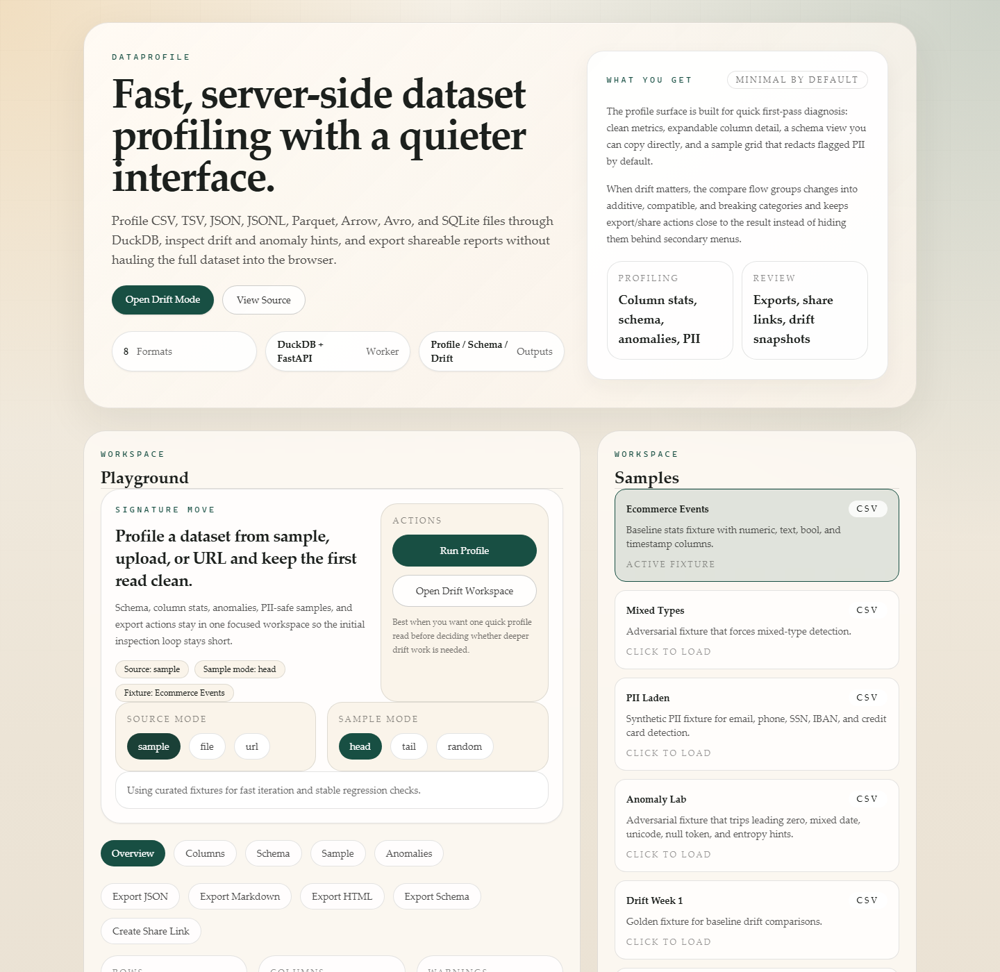

# DataProfile

DataProfile is an open-source online dataset profile tool for CSV, TSV, JSON, JSONL, Parquet, Arrow, Avro, and SQLite files. It profiles schema, column stats, JSON Schema output, drift changes, anomalies, and PII hints without loading the whole dataset into memory.



Hosted app: deployment pending. Use the local stack at `http://localhost:3000` until a production URL is published.

## Workspace

- `apps/web`: Next.js 15 playground UI.
- `apps/worker`: FastAPI worker backed by DuckDB.
- `packages/shared-types`: shared contracts for profile, drift, and schema data.
- `packages/shared-ui`: shared UI primitives for cards and result panes.
- `packages/shared-worker-runtime`: client/runtime helpers and sample metadata.

## Local development

```bash
pnpm install
python -m pip install -e apps/worker[dev]
docker compose up --build
```

The web app runs on `http://localhost:3000` and the worker health check is `http://localhost:8080/v1/health`.

## Self-host

1. Install the workspace dependencies:

   ```bash
   pnpm install
   python -m pip install -e apps/worker[dev]
   ```

2. Build the web app and start both services:

   ```bash
   pnpm build
   python -m uvicorn main:app --app-dir apps/worker/src --host 0.0.0.0 --port 8080
   pnpm --dir apps/web start -- --hostname 0.0.0.0 --port 3000
   ```

3. Or run the stack with Docker Compose:

   ```bash
   docker compose up --build
   ```

4. Verify the worker and web entrypoints:

   ```bash
   curl -sf http://localhost:8080/v1/health
   curl -I http://localhost:3000
   ```

## Release artifacts

Publishing a GitHub Release now builds both container images through `.github/workflows/release.yml`.
Published tags push:

- `ghcr.io/<owner>/dataprofile-web:<tag>`
- `ghcr.io/<owner>/dataprofile-worker:<tag>`

Manual `workflow_dispatch` runs can build-only for smoke verification or push with a custom tag.

## Verification helpers

Repeatable qualification-oriented commands:

```bash
pnpm test:worker-coverage
pnpm verify:local-stack
pnpm lighthouse
python scripts/benchmark_worker.py profile-csv --target-mb 25 --repeats 3
python scripts/benchmark_worker.py profile-parquet --target-mb 25 --repeats 3
python scripts/benchmark_worker.py drift-csv --target-mb 25 --repeats 3
python scripts/benchmark_worker.py memory-soak-csv --target-mb 25 --iterations 10
```

The worker health response also reports configured runtime limits for memory, CPU, wall clock, and open files.
